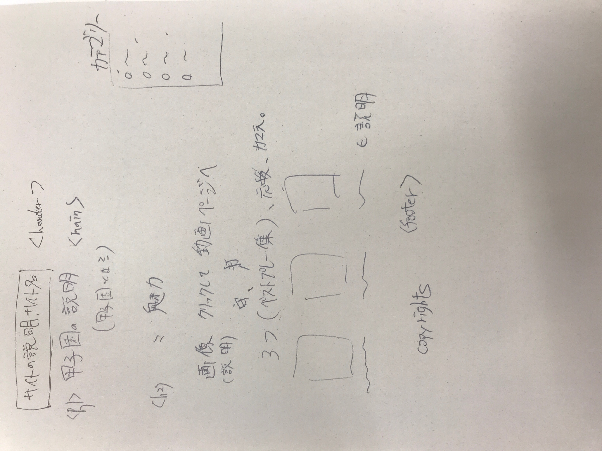

# 甲子園紹介サイト(仮)

甲子園の情報を紹介するサイト

## チーム名

チームB

## メンバー名

多田

原田

## Cssリセット

Normalize.css

## classの命名規則

OOCSSを採用する。

## WEBサイトの全体図




## カラーパレット

### メイン

緑：#228b22

ライト：#adff2f

ダーク：#006400

### ベースカラー

白　white

 ### アクセントカラー

赤：#ff2e4f

## フォントサイズ

```
font-size

h4： 14px / 1.618 = 8.653px
p, h3：14px
h2：14px * 1.618 = 22.65px
h1：14px * 1.618 **2 = 36.65px
```

## 担当

Header,Footer,Sidebar:原田

Main:多田

